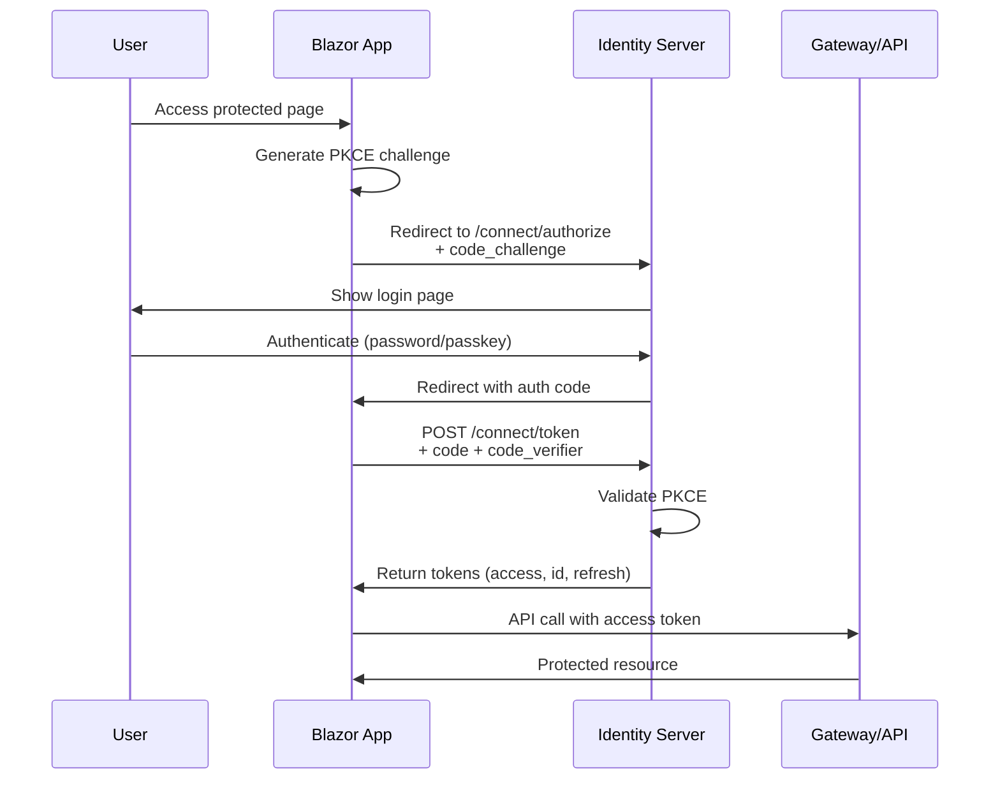
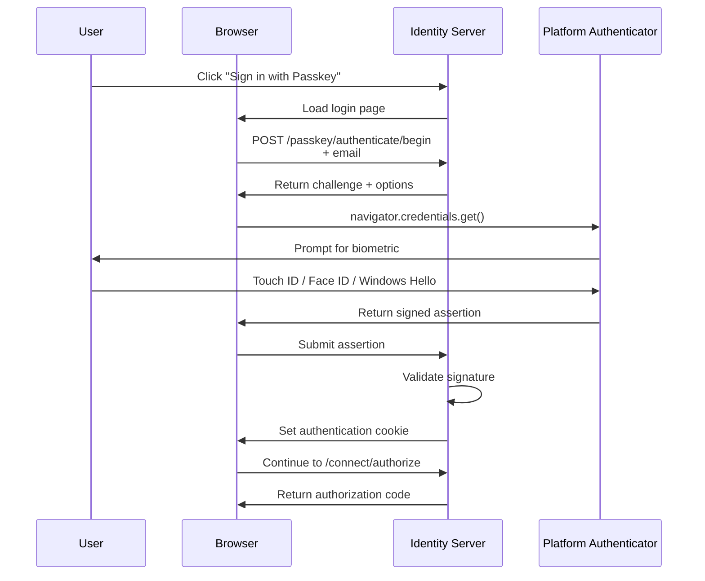

# Blazor + OpenIddict Implementation Guide
## Authorization Code Flow with PKCE and Passkey Support

**Document Version:** 1.0
**Last Updated:** 2025-01-19
**Status:** Implementation Guide

---

## Table of Contents

1. [Executive Summary](#executive-summary)
2. [Current State Analysis](#current-state-analysis)
3. [Target Architecture](#target-architecture)
4. [Prerequisites](#prerequisites)
5. [Phase 1: Identity Server Implementation](#phase-1-identity-server-implementation)
6. [Phase 2: Blazor Application Setup](#phase-2-blazor-application-setup)
7. [Phase 3: Testing & Validation](#phase-3-testing--validation)
8. [Security Considerations](#security-considerations)
9. [Troubleshooting](#troubleshooting)
10. [Future Enhancements](#future-enhancements)

---

## Executive Summary

This document provides a comprehensive guide for implementing **OAuth 2.0 Authorization Code Flow with PKCE (Proof Key for Code Exchange)** and **WebAuthn Passkey support** in the R2.ShopNet Identity Server, enabling secure authentication for Blazor Server applications.

### Goals

- ✅ Implement industry-standard OAuth 2.0 / OpenID Connect authentication
- ✅ Support passwordless authentication via WebAuthn passkeys
- ✅ Enable secure authentication for Blazor Server applications
- ✅ Follow security best practices (PKCE, HTTPS, secure token handling)
- ✅ Maintain existing passkey infrastructure

### Key Benefits

1. **Security**: PKCE prevents authorization code interception attacks
2. **User Experience**: Modern passwordless authentication with biometrics
3. **Standards Compliance**: Full OAuth 2.0 and OpenID Connect support
4. **Flexibility**: Works with multiple client types (Blazor, Angular, mobile)
5. **Production Ready**: Battle-tested authentication patterns

---

## Current State Analysis

### What We Have

**Identity Server (R2.ShopNet.Identity.API)**
- ✅ OpenIddict configured with Entity Framework Core
- ✅ PostgreSQL database with Guid-based IDs
- ✅ Token endpoint (`/connect/token`)
- ✅ Password flow (Resource Owner Password Credentials)
- ✅ Refresh token flow
- ✅ **Custom passkey grant type** (`urn:ietf:params:oauth:grant-type:passkey`)
- ✅ WebAuthn/FIDO2 implementation (native .NET, no external libraries)
- ✅ Passkey registration and management endpoints

**Current Flows**
```
Password Flow (Angular Admin):
User → Enter credentials → POST /connect/token → Receive tokens

Passkey Flow (Angular Admin):
User → Enter email → GET challenge → WebAuthn ceremony →
POST /connect/token (custom grant) → Receive tokens
```

**Current Endpoints**
- `POST /connect/token` - Token issuance
- `POST /connect/endsession` - Logout
- `POST /passkey/authenticate/begin` - Get passkey challenge
- `POST /passkey/register/begin` - Start passkey registration
- `POST /passkey/register/complete` - Complete passkey registration
- `GET /passkey/credentials` - List user's passkeys
- `DELETE /passkey/credentials/{id}` - Delete passkey

### What We Need

**Missing Components**
- ❌ Authorization endpoint (`/connect/authorize`)
- ❌ Authorization Code Flow support
- ❌ PKCE implementation
- ❌ Login UI for authorization flow
- ❌ Consent handling
- ❌ Blazor client registration

---

## Target Architecture

### Authorization Code Flow with PKCE



### Passkey Authentication Flow



---

## Prerequisites

### Required Software

- .NET 9 SDK
- PostgreSQL 16+
- Node.js 20+ (for Angular admin)
- Modern browser with WebAuthn support

### Required NuGet Packages

**Identity Server:**
```xml
<PackageReference Include="OpenIddict.AspNetCore" Version="5.8.0" />
<PackageReference Include="OpenIddict.EntityFrameworkCore" Version="5.8.0" />
<PackageReference Include="Microsoft.AspNetCore.Authentication.Cookies" Version="9.0.0" />
```

**Blazor Application:**
```xml
<PackageReference Include="Microsoft.AspNetCore.Authentication.OpenIdConnect" Version="9.0.0" />
<PackageReference Include="Microsoft.AspNetCore.Authentication.Cookies" Version="9.0.0" />
```

### Development Certificates

Ensure HTTPS certificates are trusted:
```bash
dotnet dev-certs https --trust
```

---

## Phase 1: Identity Server Implementation

### Step 1.1: Update OpenIddict Configuration

**File:** `src/Services/Identity/R2.ShopNet.Identity.API/Program.cs`

**Location:** Around line 150-180 (where OpenIddict is configured)

**Current Configuration:**
```csharp
.AddServer(options =>
{
    options.SetTokenEndpointUris("/connect/token")
           .SetLogoutEndpointUris("/connect/endsession");

    options.AllowPasswordFlow()
           .AllowRefreshTokenFlow()
           .AllowCustomFlow("urn:ietf:params:oauth:grant-type:passkey");

    options.RegisterScopes(
        Scopes.OpenId,
        Scopes.Profile,
        Scopes.Email,
        Scopes.Roles,
        "api",
        "admin");

    // ... rest of configuration
})
```

**Updated Configuration:**
```csharp
.AddServer(options =>
{
    // Add authorization endpoint
    options.SetAuthorizationEndpointUris("/connect/authorize")
           .SetTokenEndpointUris("/connect/token")
           .SetUserinfoEndpointUris("/connect/userinfo")
           .SetLogoutEndpointUris("/connect/endsession");

    // Enable Authorization Code Flow with PKCE
    options.AllowAuthorizationCodeFlow()
           .AllowRefreshTokenFlow()
           .AllowPasswordFlow() // Keep for backward compatibility if needed
           .AllowCustomFlow("urn:ietf:params:oauth:grant-type:passkey");

    // Require PKCE for public clients
    options.RequireProofKeyForCodeExchange();

    options.RegisterScopes(
        Scopes.OpenId,
        Scopes.Profile,
        Scopes.Email,
        Scopes.Roles,
        "api",
        "admin");

    // Configure token lifetimes
    options.SetAccessTokenLifetime(TimeSpan.FromHours(1));
    options.SetIdentityTokenLifetime(TimeSpan.FromHours(1));
    options.SetRefreshTokenLifetime(TimeSpan.FromDays(14));

    // Enable ASP.NET Core integration for custom authorization logic
    options.UseAspNetCore()
           .EnableAuthorizationEndpointPassthrough()
           .EnableTokenEndpointPassthrough()
           .EnableUserinfoEndpointPassthrough()
           .EnableLogoutEndpointPassthrough()
           .DisableTransportSecurityRequirement(); // Only for development!

    // Register signing and encryption credentials
    if (builder.Environment.IsDevelopment())
    {
        options.AddDevelopmentEncryptionCertificate()
               .AddDevelopmentSigningCertificate();
    }
    else
    {
        // Production: Load from configuration or Key Vault
        // options.AddEncryptionCertificate(...)
        // options.AddSigningCertificate(...)
    }
})
```

### Step 1.2: Add Cookie Authentication

**File:** `src/Services/Identity/R2.ShopNet.Identity.API/Program.cs`

**Location:** Before OpenIddict configuration (around line 140)

```csharp
// Add cookie authentication for the authorization flow
builder.Services.AddAuthentication(CookieAuthenticationDefaults.AuthenticationScheme)
    .AddCookie(CookieAuthenticationDefaults.AuthenticationScheme, options =>
    {
        options.LoginPath = "/account/login";
        options.LogoutPath = "/account/logout";
        options.ExpireTimeSpan = TimeSpan.FromMinutes(30);
        options.SlidingExpiration = true;
        options.Cookie.Name = "R2.ShopNet.Identity";
        options.Cookie.HttpOnly = true;
        options.Cookie.SecurePolicy = CookieSecurePolicy.Always;
        options.Cookie.SameSite = SameSiteMode.Lax;
    });
```

### Step 1.3: Enable MVC and Razor Pages

**File:** `src/Services/Identity/R2.ShopNet.Identity.API/Program.cs`

**Location:** After services configuration (around line 200)

```csharp
// Add MVC and Razor Pages for login UI
builder.Services.AddControllersWithViews();
builder.Services.AddRazorPages();
```

**Update middleware pipeline (before app.Run()):**
```csharp
// Enable authentication and authorization
app.UseAuthentication();
app.UseAuthorization();

// Map controllers and Razor pages
app.MapControllers();
app.MapRazorPages();
```

### Step 1.4: Create Authorization Controller

**File:** `src/Services/Identity/R2.ShopNet.Identity.API/Controllers/AuthorizationController.cs`

**Extend existing controller with new methods:**

```csharp
using Microsoft.AspNetCore;
using Microsoft.AspNetCore.Authentication;
using Microsoft.AspNetCore.Authentication.Cookies;
using Microsoft.AspNetCore.Authorization;
using Microsoft.AspNetCore.Mvc;
using Microsoft.IdentityModel.Tokens;
using OpenIddict.Abstractions;
using OpenIddict.Server.AspNetCore;
using System.Security.Claims;
using static OpenIddict.Abstractions.OpenIddictConstants;

namespace R2.ShopNet.Identity.API.Controllers;

public partial class AuthorizationController : ControllerBase
{
    // ... existing code for token endpoint ...

    /// <summary>
    /// Handles authorization requests (Authorization Code Flow)
    /// </summary>
    [HttpGet("~/connect/authorize")]
    [HttpPost("~/connect/authorize")]
    [IgnoreAntiforgeryToken]
    public async Task<IActionResult> Authorize()
    {
        var request = HttpContext.GetOpenIddictServerRequest()
            ?? throw new InvalidOperationException("The OpenID Connect request cannot be retrieved.");

        // Retrieve the user principal stored in the authentication cookie
        var result = await HttpContext.AuthenticateAsync(CookieAuthenticationDefaults.AuthenticationScheme);

        // If the user is not authenticated, redirect to login
        if (!result.Succeeded)
        {
            // Store the original request in a query parameter
            var prompt = request.HasPrompt(Prompts.Login) ? "login" : null;

            return Challenge(
                authenticationSchemes: CookieAuthenticationDefaults.AuthenticationScheme,
                properties: new AuthenticationProperties
                {
                    RedirectUri = Request.PathBase + Request.Path + QueryString.Create(
                        Request.HasFormContentType ? Request.Form.ToList() : Request.Query.ToList())
                });
        }

        // Get the user from the authentication cookie
        var userId = result.Principal.FindFirst(ClaimTypes.NameIdentifier)?.Value
            ?? throw new InvalidOperationException("User ID cannot be found in the authentication cookie.");

        var user = await _userManager.FindByIdAsync(userId);
        if (user == null)
        {
            return Forbid(
                authenticationSchemes: OpenIddictServerAspNetCoreDefaults.AuthenticationScheme,
                properties: new AuthenticationProperties(new Dictionary<string, string?>
                {
                    [OpenIddictServerAspNetCoreConstants.Properties.Error] = Errors.InvalidGrant,
                    [OpenIddictServerAspNetCoreConstants.Properties.ErrorDescription] =
                        "The user associated with the authentication cookie no longer exists."
                }));
        }

        // Retrieve the application details from the database
        var application = await _applicationManager.FindByClientIdAsync(request.ClientId!)
            ?? throw new InvalidOperationException("The application cannot be found.");

        // Retrieve the permanent authorizations associated with the user and the calling application
        var authorizations = await _authorizationManager.FindAsync(
            subject: userId,
            client: (await _applicationManager.GetIdAsync(application))!,
            status: Statuses.Valid,
            type: AuthorizationTypes.Permanent,
            scopes: request.GetScopes()).ToListAsync();

        // Check if consent is required (optional - you can skip this for trusted apps)
        var consentType = await _applicationManager.GetConsentTypeAsync(application);

        switch (consentType)
        {
            case ConsentTypes.External when authorizations.Count == 0:
                // Return error if no authorization exists and external consent is required
                return Forbid(
                    authenticationSchemes: OpenIddictServerAspNetCoreDefaults.AuthenticationScheme,
                    properties: new AuthenticationProperties(new Dictionary<string, string?>
                    {
                        [OpenIddictServerAspNetCoreConstants.Properties.Error] = Errors.ConsentRequired,
                        [OpenIddictServerAspNetCoreConstants.Properties.ErrorDescription] =
                            "The user must grant access to this application."
                    }));

            case ConsentTypes.Implicit:
            case ConsentTypes.External when authorizations.Count > 0:
            case ConsentTypes.Explicit when authorizations.Count > 0 && !request.HasPrompt(Prompts.Consent):
                // Authorization exists or consent is implicit - proceed
                break;

            case ConsentTypes.Explicit when request.HasPrompt(Prompts.Consent):
            case ConsentTypes.Systematic:
                // Show consent screen (implement if needed)
                // For now, we'll auto-approve for trusted first-party apps
                break;

            default:
                throw new InvalidOperationException("Invalid consent type.");
        }

        // Create authorization if it doesn't exist
        var authorization = authorizations.LastOrDefault();
        if (authorization == null)
        {
            authorization = await _authorizationManager.CreateAsync(
                identity: result.Principal!,
                subject: userId,
                client: (await _applicationManager.GetIdAsync(application))!,
                type: AuthorizationTypes.Permanent,
                scopes: request.GetScopes());
        }

        // Create claims principal for the token
        var principal = await CreateClaimsPrincipalAsync(user, request.GetScopes(), authorization);

        // Set the authorization ID
        principal.SetAuthorizationId(await _authorizationManager.GetIdAsync(authorization));

        // Ask OpenIddict to generate the authorization response
        return SignIn(principal, OpenIddictServerAspNetCoreDefaults.AuthenticationScheme);
    }

    /// <summary>
    /// Handles userinfo requests
    /// </summary>
    [Authorize(AuthenticationSchemes = OpenIddictServerAspNetCoreDefaults.AuthenticationScheme)]
    [HttpGet("~/connect/userinfo")]
    [HttpPost("~/connect/userinfo")]
    public async Task<IActionResult> Userinfo()
    {
        var userId = User.FindFirst(ClaimTypes.NameIdentifier)?.Value;
        if (string.IsNullOrEmpty(userId))
        {
            return Challenge(
                authenticationSchemes: OpenIddictServerAspNetCoreDefaults.AuthenticationScheme,
                properties: new AuthenticationProperties(new Dictionary<string, string?>
                {
                    [OpenIddictServerAspNetCoreConstants.Properties.Error] = Errors.InvalidToken,
                    [OpenIddictServerAspNetCoreConstants.Properties.ErrorDescription] =
                        "The specified access token is invalid."
                }));
        }

        var user = await _userManager.FindByIdAsync(userId);
        if (user == null)
        {
            return Challenge(
                authenticationSchemes: OpenIddictServerAspNetCoreDefaults.AuthenticationScheme,
                properties: new AuthenticationProperties(new Dictionary<string, string?>
                {
                    [OpenIddictServerAspNetCoreConstants.Properties.Error] = Errors.InvalidToken,
                    [OpenIddictServerAspNetCoreConstants.Properties.ErrorDescription] =
                        "The user associated with this token no longer exists."
                }));
        }

        var claims = new Dictionary<string, object>(StringComparer.Ordinal)
        {
            [Claims.Subject] = userId
        };

        // Add claims based on granted scopes
        if (User.HasScope(Scopes.Email))
        {
            claims[Claims.Email] = user.Email!;
            claims[Claims.EmailVerified] = user.EmailConfirmed;
        }

        if (User.HasScope(Scopes.Profile))
        {
            claims[Claims.Name] = user.UserName!;
            claims[Claims.PreferredUsername] = user.UserName!;
        }

        if (User.HasScope(Scopes.Roles))
        {
            var roles = await _userManager.GetRolesAsync(user);
            claims[Claims.Role] = roles;
        }

        return Ok(claims);
    }

    /// <summary>
    /// Creates claims principal with proper scopes and claims
    /// </summary>
    private async Task<ClaimsPrincipal> CreateClaimsPrincipalAsync(
        ApplicationUser user,
        ImmutableArray<string> scopes,
        object? authorization = null)
    {
        var identity = new ClaimsIdentity(
            authenticationType: TokenValidationParameters.DefaultAuthenticationType,
            nameType: Claims.Name,
            roleType: Claims.Role);

        // Add required claims
        identity.AddClaim(new Claim(Claims.Subject, user.Id.ToString()));
        identity.AddClaim(new Claim(Claims.Name, user.UserName!));
        identity.AddClaim(new Claim(Claims.PreferredUsername, user.UserName!));

        // Add email claims if email scope is requested
        if (scopes.Contains(Scopes.Email))
        {
            identity.AddClaim(new Claim(Claims.Email, user.Email!));
            identity.AddClaim(new Claim(Claims.EmailVerified, user.EmailConfirmed.ToString().ToLower()));
        }

        // Add profile claims if profile scope is requested
        if (scopes.Contains(Scopes.Profile))
        {
            if (!string.IsNullOrEmpty(user.FirstName))
                identity.AddClaim(new Claim(Claims.GivenName, user.FirstName));

            if (!string.IsNullOrEmpty(user.LastName))
                identity.AddClaim(new Claim(Claims.FamilyName, user.LastName));
        }

        // Add roles if roles scope is requested
        if (scopes.Contains(Scopes.Roles) || scopes.Contains("admin"))
        {
            var roles = await _userManager.GetRolesAsync(user);
            foreach (var role in roles)
            {
                identity.AddClaim(new Claim(Claims.Role, role));
            }
        }

        // Set destinations for claims (where they appear: access token, id token, or both)
        identity.SetDestinations(claim => claim.Type switch
        {
            Claims.Subject => [Destinations.AccessToken, Destinations.IdentityToken],
            Claims.Name => [Destinations.AccessToken, Destinations.IdentityToken],
            Claims.Email => [Destinations.IdentityToken],
            Claims.EmailVerified => [Destinations.IdentityToken],
            Claims.Role => [Destinations.AccessToken, Destinations.IdentityToken],
            _ => [Destinations.AccessToken]
        });

        var principal = new ClaimsPrincipal(identity);

        // Set the scopes
        principal.SetScopes(scopes);

        // Set resources (audiences)
        principal.SetResources("gateway_api");

        return principal;
    }
}
```

### Step 1.5: Create Login Page (Razor Pages)

**File:** `src/Services/Identity/R2.ShopNet.Identity.API/Pages/Account/Login.cshtml.cs`

Create the directory structure first:
```bash
mkdir -p src/Services/Identity/R2.ShopNet.Identity.API/Pages/Account
```

**Login.cshtml.cs (Page Model):**

```csharp
using Microsoft.AspNetCore.Authentication;
using Microsoft.AspNetCore.Authentication.Cookies;
using Microsoft.AspNetCore.Identity;
using Microsoft.AspNetCore.Mvc;
using Microsoft.AspNetCore.Mvc.RazorPages;
using OpenIddict.Server.AspNetCore;
using R2.ShopNet.Identity.Domain.Entities;
using System.ComponentModel.DataAnnotations;
using System.Security.Claims;

namespace R2.ShopNet.Identity.API.Pages.Account;

public class LoginModel : PageModel
{
    private readonly UserManager<ApplicationUser> _userManager;
    private readonly SignInManager<ApplicationUser> _signInManager;
    private readonly ILogger<LoginModel> _logger;

    public LoginModel(
        UserManager<ApplicationUser> userManager,
        SignInManager<ApplicationUser> signInManager,
        ILogger<LoginModel> logger)
    {
        _userManager = userManager;
        _signInManager = signInManager;
        _logger = logger;
    }

    [BindProperty]
    public InputModel Input { get; set; } = new();

    public string? ReturnUrl { get; set; }
    public string? ErrorMessage { get; set; }
    public bool ShowPasskeyOption { get; set; }

    public class InputModel
    {
        [Required]
        [EmailAddress]
        public string Email { get; set; } = string.Empty;

        [Required]
        [DataType(DataType.Password)]
        public string Password { get; set; } = string.Empty;

        [Display(Name = "Remember me?")]
        public bool RememberMe { get; set; }
    }

    public async Task<IActionResult> OnGetAsync(string? returnUrl = null)
    {
        ReturnUrl = returnUrl ?? Url.Content("~/");

        // Clear existing external cookie
        await HttpContext.SignOutAsync(CookieAuthenticationDefaults.AuthenticationScheme);

        // Check if browser supports WebAuthn (we'll handle this in JavaScript)
        ShowPasskeyOption = true;

        return Page();
    }

    public async Task<IActionResult> OnPostAsync(string? returnUrl = null)
    {
        ReturnUrl = returnUrl ?? Url.Content("~/");

        if (!ModelState.IsValid)
        {
            return Page();
        }

        var user = await _userManager.FindByEmailAsync(Input.Email);
        if (user == null)
        {
            ModelState.AddModelError(string.Empty, "Invalid email or password.");
            return Page();
        }

        var result = await _signInManager.CheckPasswordSignInAsync(user, Input.Password, lockoutOnFailure: true);

        if (result.Succeeded)
        {
            _logger.LogInformation("User {Email} logged in.", Input.Email);

            // Create claims for the authentication cookie
            var claims = new List<Claim>
            {
                new Claim(ClaimTypes.NameIdentifier, user.Id.ToString()),
                new Claim(ClaimTypes.Name, user.UserName!),
                new Claim(ClaimTypes.Email, user.Email!)
            };

            var claimsIdentity = new ClaimsIdentity(claims, CookieAuthenticationDefaults.AuthenticationScheme);
            var claimsPrincipal = new ClaimsPrincipal(claimsIdentity);

            var authProperties = new AuthenticationProperties
            {
                IsPersistent = Input.RememberMe,
                ExpiresUtc = DateTimeOffset.UtcNow.AddMinutes(30)
            };

            await HttpContext.SignInAsync(
                CookieAuthenticationDefaults.AuthenticationScheme,
                claimsPrincipal,
                authProperties);

            return LocalRedirect(ReturnUrl);
        }

        if (result.IsLockedOut)
        {
            _logger.LogWarning("User {Email} account locked out.", Input.Email);
            ModelState.AddModelError(string.Empty, "Account locked out. Please try again later.");
            return Page();
        }

        if (result.RequiresTwoFactor)
        {
            // Implement 2FA if needed
            return RedirectToPage("./LoginWith2fa", new { ReturnUrl = returnUrl, RememberMe = Input.RememberMe });
        }

        ModelState.AddModelError(string.Empty, "Invalid email or password.");
        return Page();
    }

    public async Task<IActionResult> OnPostPasskeyAsync(string? returnUrl = null)
    {
        // This will be called via AJAX from JavaScript
        // The actual authentication happens client-side with WebAuthn
        // Then we validate the assertion
        return Page();
    }
}
```

**Login.cshtml (View):**

```html
@page
@model LoginModel
@{
    ViewData["Title"] = "Sign In";
}

<!DOCTYPE html>
<html lang="en">
<head>
    <meta charset="utf-8" />
    <meta name="viewport" content="width=device-width, initial-scale=1.0" />
    <title>@ViewData["Title"] - R2.ShopNet</title>
    <style>
        * {
            margin: 0;
            padding: 0;
            box-sizing: border-box;
        }

        body {
            font-family: -apple-system, BlinkMacSystemFont, "Segoe UI", Roboto, "Helvetica Neue", Arial, sans-serif;
            background: linear-gradient(135deg, #667eea 0%, #764ba2 100%);
            min-height: 100vh;
            display: flex;
            align-items: center;
            justify-content: center;
            padding: 20px;
        }

        .login-container {
            background: white;
            border-radius: 16px;
            box-shadow: 0 20px 60px rgba(0, 0, 0, 0.3);
            width: 100%;
            max-width: 420px;
            padding: 48px 40px;
        }

        .logo {
            text-align: center;
            margin-bottom: 32px;
        }

        .logo h1 {
            color: #667eea;
            font-size: 32px;
            font-weight: 700;
            margin-bottom: 8px;
        }

        .logo p {
            color: #6b7280;
            font-size: 14px;
        }

        .form-group {
            margin-bottom: 24px;
        }

        label {
            display: block;
            color: #374151;
            font-size: 14px;
            font-weight: 500;
            margin-bottom: 8px;
        }

        input[type="email"],
        input[type="password"] {
            width: 100%;
            padding: 12px 16px;
            border: 2px solid #e5e7eb;
            border-radius: 8px;
            font-size: 15px;
            transition: all 0.2s;
        }

        input[type="email"]:focus,
        input[type="password"]:focus {
            outline: none;
            border-color: #667eea;
            box-shadow: 0 0 0 3px rgba(102, 126, 234, 0.1);
        }

        .checkbox-group {
            display: flex;
            align-items: center;
            margin-bottom: 24px;
        }

        input[type="checkbox"] {
            margin-right: 8px;
            width: 18px;
            height: 18px;
            cursor: pointer;
        }

        .checkbox-group label {
            margin: 0;
            font-size: 14px;
            color: #6b7280;
            cursor: pointer;
        }

        .btn-primary {
            width: 100%;
            padding: 14px;
            background: linear-gradient(135deg, #667eea 0%, #764ba2 100%);
            color: white;
            border: none;
            border-radius: 8px;
            font-size: 15px;
            font-weight: 600;
            cursor: pointer;
            transition: transform 0.2s, box-shadow 0.2s;
        }

        .btn-primary:hover {
            transform: translateY(-2px);
            box-shadow: 0 10px 20px rgba(102, 126, 234, 0.3);
        }

        .btn-primary:active {
            transform: translateY(0);
        }

        .btn-passkey {
            width: 100%;
            padding: 14px;
            background: white;
            color: #667eea;
            border: 2px solid #667eea;
            border-radius: 8px;
            font-size: 15px;
            font-weight: 600;
            cursor: pointer;
            margin-top: 16px;
            transition: all 0.2s;
            display: flex;
            align-items: center;
            justify-content: center;
            gap: 8px;
        }

        .btn-passkey:hover {
            background: #f3f4f6;
        }

        .divider {
            text-align: center;
            margin: 24px 0;
            position: relative;
        }

        .divider::before {
            content: '';
            position: absolute;
            top: 50%;
            left: 0;
            right: 0;
            height: 1px;
            background: #e5e7eb;
        }

        .divider span {
            background: white;
            padding: 0 16px;
            color: #6b7280;
            font-size: 14px;
            position: relative;
        }

        .error-message {
            background: #fee2e2;
            border: 1px solid #fecaca;
            color: #991b1b;
            padding: 12px;
            border-radius: 8px;
            margin-bottom: 24px;
            font-size: 14px;
        }

        .passkey-icon {
            width: 20px;
            height: 20px;
        }

        #loading {
            display: none;
            text-align: center;
            padding: 20px;
        }

        .spinner {
            border: 3px solid #f3f4f6;
            border-top: 3px solid #667eea;
            border-radius: 50%;
            width: 40px;
            height: 40px;
            animation: spin 1s linear infinite;
            margin: 0 auto;
        }

        @@keyframes spin {
            0% { transform: rotate(0deg); }
            100% { transform: rotate(360deg); }
        }
    </style>
</head>
<body>
    <div class="login-container">
        <div class="logo">
            <h1>R2.ShopNet</h1>
            <p>Sign in to your account</p>
        </div>

        @if (!string.IsNullOrEmpty(Model.ErrorMessage))
        {
            <div class="error-message">
                @Model.ErrorMessage
            </div>
        }

        <div asp-validation-summary="All" class="error-message" style="display: none;"></div>

        <div id="login-form">
            <form method="post">
                <input type="hidden" name="ReturnUrl" value="@Model.ReturnUrl" />

                <div class="form-group">
                    <label asp-for="Input.Email">Email</label>
                    <input asp-for="Input.Email" type="email" autocomplete="username" />
                    <span asp-validation-for="Input.Email" class="text-danger"></span>
                </div>

                <div class="form-group">
                    <label asp-for="Input.Password">Password</label>
                    <input asp-for="Input.Password" type="password" autocomplete="current-password" />
                    <span asp-validation-for="Input.Password" class="text-danger"></span>
                </div>

                <div class="checkbox-group">
                    <input asp-for="Input.RememberMe" type="checkbox" />
                    <label asp-for="Input.RememberMe">Remember me</label>
                </div>

                <button type="submit" class="btn-primary">Sign In</button>
            </form>

            @if (Model.ShowPasskeyOption)
            {
                <div class="divider">
                    <span>OR</span>
                </div>

                <button type="button" id="passkey-button" class="btn-passkey">
                    <svg class="passkey-icon" fill="none" stroke="currentColor" viewBox="0 0 24 24">
                        <path stroke-linecap="round" stroke-linejoin="round" stroke-width="2" d="M15 7a2 2 0 012 2m4 0a6 6 0 01-7.743 5.743L11 17H9v2H7v2H4a1 1 0 01-1-1v-2.586a1 1 0 01.293-.707l5.964-5.964A6 6 0 1121 9z" />
                    </svg>
                    Sign in with Passkey
                </button>
            }
        </div>

        <div id="loading">
            <div class="spinner"></div>
            <p style="margin-top: 16px; color: #6b7280;">Authenticating...</p>
        </div>
    </div>

    <script src="~/js/passkey-login.js"></script>

    @section Scripts {
        <partial name="_ValidationScriptsPartial" />
    }
</body>
</html>
```

### Step 1.6: Create Passkey Login JavaScript

**File:** `src/Services/Identity/R2.ShopNet.Identity.API/wwwroot/js/passkey-login.js`

```javascript
// Passkey Login JavaScript
(function() {
    'use strict';

    // Check if WebAuthn is supported
    const isWebAuthnSupported = () => {
        return !!(
            window.PublicKeyCredential &&
            navigator.credentials &&
            typeof navigator.credentials.create === 'function' &&
            typeof navigator.credentials.get === 'function'
        );
    };

    // Hide passkey button if not supported
    if (!isWebAuthnSupported()) {
        const passkeyButton = document.getElementById('passkey-button');
        if (passkeyButton) {
            passkeyButton.style.display = 'none';
            const divider = document.querySelector('.divider');
            if (divider) divider.style.display = 'none';
        }
        return;
    }

    // Base64 URL encoding/decoding helpers
    const base64UrlDecode = (input) => {
        input = input.replace(/-/g, '+').replace(/_/g, '/');
        const pad = input.length % 4;
        if (pad) {
            if (pad === 1) {
                throw new Error('Invalid base64url string');
            }
            input += new Array(5 - pad).join('=');
        }
        return Uint8Array.from(atob(input), c => c.charCodeAt(0));
    };

    const base64UrlEncode = (buffer) => {
        const binary = String.fromCharCode(...new Uint8Array(buffer));
        return btoa(binary)
            .replace(/\+/g, '-')
            .replace(/\//g, '_')
            .replace(/=/g, '');
    };

    // Show/hide loading state
    const showLoading = (show) => {
        const form = document.getElementById('login-form');
        const loading = document.getElementById('loading');
        if (show) {
            form.style.display = 'none';
            loading.style.display = 'block';
        } else {
            form.style.display = 'block';
            loading.style.display = 'none';
        }
    };

    // Show error message
    const showError = (message) => {
        const validationSummary = document.querySelector('[asp-validation-summary]');
        if (validationSummary) {
            validationSummary.style.display = 'block';
            validationSummary.innerHTML = `<div class="error-message">${message}</div>`;
        } else {
            alert(message);
        }
    };

    // Handle passkey login
    const handlePasskeyLogin = async () => {
        try {
            showLoading(true);

            // Get email from the form
            const emailInput = document.querySelector('input[name="Input.Email"]');
            const email = emailInput?.value?.trim();

            if (!email) {
                showError('Please enter your email address.');
                showLoading(false);
                return;
            }

            // Step 1: Begin authentication - get challenge from server
            const beginResponse = await fetch('/passkey/authenticate/begin', {
                method: 'POST',
                headers: {
                    'Content-Type': 'application/json',
                },
                body: JSON.stringify({ username: email })
            });

            if (!beginResponse.ok) {
                const error = await beginResponse.json();
                throw new Error(error.message || 'Failed to initiate passkey authentication');
            }

            const options = await beginResponse.json();

            // Step 2: Convert base64url strings to ArrayBuffers
            const credentialRequestOptions = {
                publicKey: {
                    challenge: base64UrlDecode(options.challenge),
                    timeout: options.timeout || 60000,
                    rpId: options.rpId,
                    allowCredentials: options.allowCredentials?.map(cred => ({
                        type: 'public-key',
                        id: base64UrlDecode(cred.id),
                        transports: cred.transports
                    })) || [],
                    userVerification: options.userVerification || 'preferred'
                }
            };

            // Step 3: Call WebAuthn API
            const credential = await navigator.credentials.get(credentialRequestOptions);

            if (!credential) {
                throw new Error('No credential returned from authenticator');
            }

            // Step 4: Prepare assertion for server
            const assertion = {
                id: credential.id,
                rawId: base64UrlEncode(credential.rawId),
                type: credential.type,
                response: {
                    clientDataJSON: base64UrlEncode(credential.response.clientDataJSON),
                    authenticatorData: base64UrlEncode(credential.response.authenticatorData),
                    signature: base64UrlEncode(credential.response.signature),
                    userHandle: credential.response.userHandle ?
                        base64UrlEncode(credential.response.userHandle) : null
                }
            };

            // Step 5: Send assertion to server for validation
            const completeResponse = await fetch('/passkey/authenticate/complete', {
                method: 'POST',
                headers: {
                    'Content-Type': 'application/json',
                },
                body: JSON.stringify({
                    username: email,
                    assertion: assertion
                })
            });

            if (!completeResponse.ok) {
                const error = await completeResponse.json();
                throw new Error(error.message || 'Failed to validate passkey');
            }

            const result = await completeResponse.json();

            // Step 6: Authentication successful - redirect to return URL
            const urlParams = new URLSearchParams(window.location.search);
            const returnUrl = urlParams.get('ReturnUrl') || '/';
            window.location.href = returnUrl;

        } catch (error) {
            console.error('Passkey login error:', error);

            let errorMessage = 'An error occurred during passkey authentication.';

            if (error.name === 'NotAllowedError') {
                errorMessage = 'Authentication was cancelled or timed out.';
            } else if (error.name === 'InvalidStateError') {
                errorMessage = 'This passkey has already been registered.';
            } else if (error.name === 'NotSupportedError') {
                errorMessage = 'Passkeys are not supported on this device.';
            } else if (error.message) {
                errorMessage = error.message;
            }

            showError(errorMessage);
            showLoading(false);
        }
    };

    // Attach event listener
    const passkeyButton = document.getElementById('passkey-button');
    if (passkeyButton) {
        passkeyButton.addEventListener('click', handlePasskeyLogin);
    }
})();
```

### Step 1.7: Update Passkey Authentication to Set Cookie

**File:** `src/Services/Identity/R2.ShopNet.Identity.API/Controllers/PasskeyController.cs`

Add a new endpoint for passkey authentication that sets the authentication cookie:

```csharp
/// <summary>
/// Complete passkey authentication and set authentication cookie
/// </summary>
[HttpPost("authenticate/complete")]
public async Task<IActionResult> CompleteAuthentication([FromBody] PasskeyAuthenticationRequest request)
{
    try
    {
        // Validate the WebAuthn assertion
        var result = await _passkeyService.CompleteAuthenticationAsync(
            request.Username,
            request.Assertion);

        if (!result.IsSuccess)
        {
            return BadRequest(new { message = result.ErrorMessage });
        }

        // Get the user
        var user = await _userManager.FindByEmailAsync(request.Username);
        if (user == null)
        {
            return BadRequest(new { message = "User not found" });
        }

        // Create claims for the authentication cookie
        var claims = new List<Claim>
        {
            new Claim(ClaimTypes.NameIdentifier, user.Id.ToString()),
            new Claim(ClaimTypes.Name, user.UserName!),
            new Claim(ClaimTypes.Email, user.Email!)
        };

        var claimsIdentity = new ClaimsIdentity(
            claims,
            CookieAuthenticationDefaults.AuthenticationScheme);

        var claimsPrincipal = new ClaimsPrincipal(claimsIdentity);

        var authProperties = new AuthenticationProperties
        {
            IsPersistent = true,
            ExpiresUtc = DateTimeOffset.UtcNow.AddMinutes(30)
        };

        await HttpContext.SignInAsync(
            CookieAuthenticationDefaults.AuthenticationScheme,
            claimsPrincipal,
            authProperties);

        return Ok(new { success = true });
    }
    catch (Exception ex)
    {
        _logger.LogError(ex, "Error completing passkey authentication");
        return BadRequest(new { message = "Authentication failed" });
    }
}

public record PasskeyAuthenticationRequest(
    string Username,
    object Assertion);
```

### Step 1.8: Register Blazor Client

**File:** `src/Services/Identity/R2.ShopNet.Identity.Infrastructure/Seed/OpenIddictSeeder.cs`

Add the Blazor client registration:

```csharp
// Blazor Server Admin Application
if (await _applicationManager.FindByClientIdAsync("blazor-admin") is null)
{
    await _applicationManager.CreateAsync(new OpenIddictApplicationDescriptor
    {
        ClientId = "blazor-admin",
        ClientType = ClientTypes.Confidential, // Server-side app
        ClientSecret = "your-secure-client-secret-change-in-production", // TODO: Use secure secret
        DisplayName = "Blazor Admin Application",
        ConsentType = ConsentTypes.Implicit, // Auto-approve for first-party app

        Permissions =
        {
            Permissions.Endpoints.Authorization,
            Permissions.Endpoints.Token,
            Permissions.Endpoints.Logout,
            Permissions.GrantTypes.AuthorizationCode,
            Permissions.GrantTypes.RefreshToken,
            Permissions.ResponseTypes.Code,
            Permissions.Scopes.Email,
            Permissions.Scopes.Profile,
            Permissions.Scopes.Roles,
            Permissions.Prefixes.Scope + "api",
            Permissions.Prefixes.Scope + "admin"
        },

        RedirectUris =
        {
            new Uri("https://localhost:7000/signin-oidc")
        },
        PostLogoutRedirectUris =
        {
            new Uri("https://localhost:7000/signout-callback-oidc")
        },

        Requirements =
        {
            Requirements.Features.ProofKeyForCodeExchange
        }
    });
}
```

### Step 1.9: Update CORS Configuration

**File:** `src/Services/Identity/R2.ShopNet.Identity.API/Program.cs`

Update CORS to allow the Blazor application:

```csharp
builder.Services.AddCors(options =>
{
    options.AddDefaultPolicy(policy =>
    {
        policy.WithOrigins(
            "http://localhost:4200",   // Angular admin (dev)
            "https://localhost:4200",  // Angular admin (SSL)
            "https://localhost:5000",  // Gateway
            "https://localhost:7000"   // Blazor admin (NEW)
        )
        .AllowAnyHeader()
        .AllowAnyMethod()
        .AllowCredentials();
    });
});
```

---

## Phase 2: Blazor Application Setup

### Step 2.1: Create Blazor Project

Run the following commands:

```bash
cd src/Web
dotnet new blazor -n R2.ShopNet.Web.BlazorAdmin --interactivity Server --framework net9.0
cd R2.ShopNet.Web.BlazorAdmin
```

### Step 2.2: Install Required Packages

```bash
dotnet add package Microsoft.AspNetCore.Authentication.OpenIdConnect --version 9.0.0
dotnet add package Microsoft.AspNetCore.Authentication.Cookies --version 9.0.0
```

### Step 2.3: Configure Authentication

**File:** `src/Web/R2.ShopNet.Web.BlazorAdmin/Program.cs`

```csharp
using Microsoft.AspNetCore.Authentication.Cookies;
using Microsoft.AspNetCore.Authentication.OpenIdConnect;
using Microsoft.IdentityModel.Protocols.OpenIdConnect;
using System.IdentityModel.Tokens.Jwt;

var builder = WebApplication.CreateBuilder(args);

// Add services to the container
builder.Services.AddRazorComponents()
    .AddInteractiveServerComponents();

// Configure authentication
JwtSecurityTokenHandler.DefaultMapInboundClaims = false;

builder.Services.AddAuthentication(options =>
{
    options.DefaultScheme = CookieAuthenticationDefaults.AuthenticationScheme;
    options.DefaultChallengeScheme = OpenIdConnectDefaults.AuthenticationScheme;
})
.AddCookie(CookieAuthenticationDefaults.AuthenticationScheme, options =>
{
    options.Cookie.Name = "R2.ShopNet.Blazor";
    options.Cookie.SameSite = SameSiteMode.Lax;
    options.Cookie.SecurePolicy = CookieSecurePolicy.Always;
})
.AddOpenIdConnect(OpenIdConnectDefaults.AuthenticationScheme, options =>
{
    // Identity Server settings
    options.Authority = "https://localhost:5003";
    options.ClientId = "blazor-admin";
    options.ClientSecret = "your-secure-client-secret-change-in-production";

    options.ResponseType = OpenIdConnectResponseType.Code;
    options.ResponseMode = OpenIdConnectResponseMode.Query;

    options.SaveTokens = true;
    options.RequireHttpsMetadata = true;
    options.GetClaimsFromUserInfoEndpoint = true;

    // Scopes
    options.Scope.Clear();
    options.Scope.Add("openid");
    options.Scope.Add("profile");
    options.Scope.Add("email");
    options.Scope.Add("roles");
    options.Scope.Add("api");
    options.Scope.Add("admin");

    // PKCE
    options.UsePkce = true;

    // Claim mapping
    options.TokenValidationParameters.NameClaimType = "name";
    options.TokenValidationParameters.RoleClaimType = "role";

    // For development: accept self-signed certificates
    if (builder.Environment.IsDevelopment())
    {
        options.BackchannelHttpHandler = new HttpClientHandler
        {
            ServerCertificateCustomValidationCallback =
                HttpClientHandler.DangerousAcceptAnyServerCertificateValidator
        };
    }

    // Events for debugging
    options.Events = new OpenIdConnectEvents
    {
        OnAuthenticationFailed = context =>
        {
            context.Response.Redirect("/error");
            context.HandleResponse();
            return Task.CompletedTask;
        },
        OnRemoteFailure = context =>
        {
            context.Response.Redirect("/error");
            context.HandleResponse();
            return Task.CompletedTask;
        }
    };
});

builder.Services.AddAuthorization();
builder.Services.AddCascadingAuthenticationState();

// Configure HTTPS
builder.WebHost.UseUrls("https://localhost:7000");

var app = builder.Build();

// Configure the HTTP request pipeline
if (!app.Environment.IsDevelopment())
{
    app.UseExceptionHandler("/Error", createScopeForErrors: true);
    app.UseHsts();
}

app.UseHttpsRedirection();
app.UseStaticFiles();
app.UseAntiforgery();

app.UseAuthentication();
app.UseAuthorization();

app.MapRazorComponents<App>()
    .AddInteractiveServerRenderMode();

// Add logout endpoint
app.MapGet("/logout", async (HttpContext context) =>
{
    await context.SignOutAsync(CookieAuthenticationDefaults.AuthenticationScheme);
    await context.SignOutAsync(OpenIdConnectDefaults.AuthenticationScheme);
    return Results.Redirect("/");
});

app.Run();
```

### Step 2.4: Update App Configuration

**File:** `src/Web/R2.ShopNet.Web.BlazorAdmin/appsettings.json`

```json
{
  "Logging": {
    "LogLevel": {
      "Default": "Information",
      "Microsoft.AspNetCore": "Warning",
      "Microsoft.AspNetCore.Authentication": "Debug"
    }
  },
  "AllowedHosts": "*",
  "Authentication": {
    "Authority": "https://localhost:5003",
    "ClientId": "blazor-admin",
    "ClientSecret": "your-secure-client-secret-change-in-production",
    "Scopes": "openid profile email roles api admin"
  }
}
```

### Step 2.5: Create Authentication Components

**File:** `src/Web/R2.ShopNet.Web.BlazorAdmin/Components/Layout/LoginDisplay.razor`

```razor
@using Microsoft.AspNetCore.Components.Authorization

<AuthorizeView>
    <Authorized>
        <div class="user-info">
            <span class="user-name">Hello, @context.User.Identity?.Name!</span>
            <a href="/logout" class="btn-logout">Logout</a>
        </div>
    </Authorized>
    <NotAuthorized>
        <a href="/login" class="btn-login">Login</a>
    </NotAuthorized>
</AuthorizeView>

<style>
    .user-info {
        display: flex;
        align-items: center;
        gap: 16px;
    }

    .user-name {
        font-size: 14px;
        color: #374151;
    }

    .btn-logout,
    .btn-login {
        padding: 8px 16px;
        background: #667eea;
        color: white;
        text-decoration: none;
        border-radius: 6px;
        font-size: 14px;
        font-weight: 500;
        transition: background 0.2s;
    }

    .btn-logout:hover,
    .btn-login:hover {
        background: #5568d3;
    }
</style>
```

**File:** `src/Web/R2.ShopNet.Web.BlazorAdmin/Components/Pages/Login.razor`

```razor
@page "/login"
@using Microsoft.AspNetCore.Authentication
@using Microsoft.AspNetCore.Authentication.OpenIdConnect
@inject NavigationManager Navigation

@code {
    protected override void OnInitialized()
    {
        // This will trigger the OIDC authentication flow
        Navigation.NavigateTo($"/challenge?returnUrl={Uri.EscapeDataString(Navigation.Uri)}", true);
    }
}
```

**File:** `src/Web/R2.ShopNet.Web.BlazorAdmin/Components/Pages/Challenge.razor`

```razor
@page "/challenge"
@using Microsoft.AspNetCore.Authentication
@using Microsoft.AspNetCore.Authentication.OpenIdConnect
@attribute [Microsoft.AspNetCore.Components.RouteAttribute("/challenge")]
@code {
    [Parameter]
    [SupplyParameterFromQuery]
    public string? ReturnUrl { get; set; }

    [CascadingParameter]
    private HttpContext HttpContext { get; set; } = default!;

    protected override async Task OnInitializedAsync()
    {
        // Trigger OIDC challenge
        await HttpContext.ChallengeAsync(
            OpenIdConnectDefaults.AuthenticationScheme,
            new AuthenticationProperties
            {
                RedirectUri = ReturnUrl ?? "/"
            });
    }
}
```

### Step 2.6: Update Main Layout

**File:** `src/Web/R2.ShopNet.Web.BlazorAdmin/Components/Layout/MainLayout.razor`

```razor
@inherits LayoutComponentBase

<div class="page">
    <div class="sidebar">
        <NavMenu />
    </div>

    <main>
        <div class="top-row px-4">
            <LoginDisplay />
        </div>

        <article class="content px-4">
            @Body
        </article>
    </main>
</div>

<div id="blazor-error-ui">
    An unhandled error has occurred.
    <a href="" class="reload">Reload</a>
    <a class="dismiss">🗙</a>
</div>
```

### Step 2.7: Protect Pages with Authorization

**File:** `src/Web/R2.ShopNet.Web.BlazorAdmin/Components/Pages/Home.razor`

```razor
@page "/"
@using Microsoft.AspNetCore.Authorization
@attribute [Authorize]

<PageTitle>Home</PageTitle>

<h1>Welcome to R2.ShopNet Admin</h1>

<AuthorizeView>
    <Authorized>
        <p>Hello, @context.User.Identity?.Name!</p>
        <p>You are authenticated via OpenID Connect with passkey support.</p>

        <h2>Your Claims:</h2>
        <ul>
            @foreach (var claim in context.User.Claims)
            {
                <li><strong>@claim.Type:</strong> @claim.Value</li>
            }
        </ul>
    </Authorized>
</AuthorizeView>
```

### Step 2.8: Add Passkey Management Component

**File:** `src/Web/R2.ShopNet.Web.BlazorAdmin/Components/Pages/PasskeyManagement.razor`

```razor
@page "/account/passkeys"
@using Microsoft.AspNetCore.Authorization
@using Microsoft.AspNetCore.Components.Authorization
@using System.Net.Http.Json
@attribute [Authorize]
@inject HttpClient Http
@inject IJSRuntime JS
@inject AuthenticationStateProvider AuthenticationStateProvider

<PageTitle>Manage Passkeys</PageTitle>

<h1>Passkey Management</h1>

<div class="passkey-container">
    <div class="passkey-header">
        <h2>Your Passkeys</h2>
        <button class="btn-primary" @onclick="RegisterPasskey">Add New Passkey</button>
    </div>

    @if (passkeys == null)
    {
        <p>Loading...</p>
    }
    else if (!passkeys.Any())
    {
        <p>No passkeys registered yet.</p>
    }
    else
    {
        <div class="passkey-list">
            @foreach (var passkey in passkeys)
            {
                <div class="passkey-item">
                    <div class="passkey-info">
                        <strong>@passkey.DeviceName</strong>
                        <span class="passkey-date">Created: @passkey.CreatedAt.ToString("g")</span>
                        <span class="passkey-date">Last used: @(passkey.LastUsedAt?.ToString("g") ?? "Never")</span>
                    </div>
                    <button class="btn-danger" @onclick="() => DeletePasskey(passkey.Id)">Delete</button>
                </div>
            }
        </div>
    }

    @if (!string.IsNullOrEmpty(errorMessage))
    {
        <div class="error-message">@errorMessage</div>
    }

    @if (!string.IsNullOrEmpty(successMessage))
    {
        <div class="success-message">@successMessage</div>
    }
</div>

@code {
    private List<PasskeyDto>? passkeys;
    private string? errorMessage;
    private string? successMessage;

    protected override async Task OnInitializedAsync()
    {
        await LoadPasskeys();
    }

    private async Task LoadPasskeys()
    {
        try
        {
            // TODO: Call API to get passkeys
            // passkeys = await Http.GetFromJsonAsync<List<PasskeyDto>>("https://localhost:5003/passkey/credentials");
            passkeys = new List<PasskeyDto>(); // Placeholder
        }
        catch (Exception ex)
        {
            errorMessage = "Failed to load passkeys.";
        }
    }

    private async Task RegisterPasskey()
    {
        try
        {
            errorMessage = null;
            successMessage = null;

            // TODO: Implement passkey registration via JavaScript interop
            // 1. Call /passkey/register/begin
            // 2. Call navigator.credentials.create()
            // 3. Call /passkey/register/complete

            successMessage = "Passkey registered successfully!";
            await LoadPasskeys();
        }
        catch (Exception ex)
        {
            errorMessage = "Failed to register passkey.";
        }
    }

    private async Task DeletePasskey(Guid id)
    {
        try
        {
            errorMessage = null;
            successMessage = null;

            // TODO: Call API to delete passkey
            // await Http.DeleteAsync($"https://localhost:5003/passkey/credentials/{id}");

            successMessage = "Passkey deleted successfully!";
            await LoadPasskeys();
        }
        catch (Exception ex)
        {
            errorMessage = "Failed to delete passkey.";
        }
    }

    public class PasskeyDto
    {
        public Guid Id { get; set; }
        public string DeviceName { get; set; } = string.Empty;
        public DateTime CreatedAt { get; set; }
        public DateTime? LastUsedAt { get; set; }
    }
}

<style>
    .passkey-container {
        max-width: 800px;
        margin: 0 auto;
    }

    .passkey-header {
        display: flex;
        justify-content: space-between;
        align-items: center;
        margin-bottom: 24px;
    }

    .passkey-list {
        display: flex;
        flex-direction: column;
        gap: 12px;
    }

    .passkey-item {
        display: flex;
        justify-content: space-between;
        align-items: center;
        padding: 16px;
        background: white;
        border: 1px solid #e5e7eb;
        border-radius: 8px;
    }

    .passkey-info {
        display: flex;
        flex-direction: column;
        gap: 4px;
    }

    .passkey-date {
        font-size: 12px;
        color: #6b7280;
    }

    .btn-primary {
        padding: 10px 20px;
        background: #667eea;
        color: white;
        border: none;
        border-radius: 6px;
        cursor: pointer;
        font-weight: 500;
    }

    .btn-danger {
        padding: 8px 16px;
        background: #ef4444;
        color: white;
        border: none;
        border-radius: 6px;
        cursor: pointer;
    }

    .error-message {
        padding: 12px;
        background: #fee2e2;
        border: 1px solid #fecaca;
        color: #991b1b;
        border-radius: 8px;
        margin-top: 16px;
    }

    .success-message {
        padding: 12px;
        background: #d1fae5;
        border: 1px solid #a7f3d0;
        color: #065f46;
        border-radius: 8px;
        margin-top: 16px;
    }
</style>
```

---

## Phase 3: Testing & Validation

### Step 3.1: Database Migration

Run the Identity Server database migration to add OpenIddict tables if not already done:

```bash
cd src/Services/Identity/R2.ShopNet.Identity.Infrastructure
dotnet ef migrations add AddAuthorizationCodeFlow --startup-project ../R2.ShopNet.Identity.API
dotnet ef database update --startup-project ../R2.ShopNet.Identity.API
```

### Step 3.2: Start Services

1. Start PostgreSQL (if not running):
```bash
docker start shopnet-postgres
```

2. Start Identity Server:
```bash
cd src/Services/Identity/R2.ShopNet.Identity.API
dotnet run
```

3. Start Blazor application:
```bash
cd src/Web/R2.ShopNet.Web.BlazorAdmin
dotnet run
```

### Step 3.3: Test Authorization Code Flow

1. Navigate to `https://localhost:7000`
2. You should be redirected to `https://localhost:5003/Account/Login`
3. Enter credentials or use passkey
4. After successful authentication, you should be redirected back to Blazor app
5. Verify claims and user information display correctly

### Step 3.4: Test Passkey Authentication

1. On the login page, click "Sign in with Passkey"
2. Enter your email
3. Browser should prompt for biometric authentication
4. After successful authentication, verify redirect to Blazor app

### Step 3.5: Test Token Refresh

1. Wait for access token to expire (1 hour default)
2. Verify that Blazor automatically refreshes the token
3. Check that user remains authenticated

### Step 3.6: Test Logout

1. Click logout button
2. Verify redirect to Identity Server logout endpoint
3. Verify redirect back to Blazor app
4. Verify user is no longer authenticated

---

## Security Considerations

### PKCE (Proof Key for Code Exchange)

PKCE protects against authorization code interception attacks:

1. **Code Challenge:** Client generates random `code_verifier` and computes `code_challenge`
2. **Authorization Request:** Client sends `code_challenge` to authorization endpoint
3. **Token Exchange:** Client sends original `code_verifier` to token endpoint
4. **Validation:** Server verifies `code_verifier` matches original `code_challenge`

This prevents attackers from exchanging a stolen authorization code for tokens.

### HTTPS Enforcement

**Production Requirements:**
- HTTPS everywhere (Identity Server, Blazor app, APIs)
- Valid SSL/TLS certificates (not self-signed)
- HSTS (HTTP Strict Transport Security)
- Secure cookie flags

### Token Security

**Best Practices:**
- Short-lived access tokens (1 hour)
- Longer-lived refresh tokens (14 days)
- Rotate refresh tokens on use
- Revoke tokens on logout
- Store tokens in HTTP-only cookies (server-side) or encrypted storage (client-side)

### Client Secret Management

**Development:**
```csharp
ClientSecret = "dev-secret-not-for-production"
```

**Production:**
```csharp
// Load from Azure Key Vault, environment variables, or secure configuration
ClientSecret = builder.Configuration["Authentication:ClientSecret"]
```

### CORS Configuration

**Principle of Least Privilege:**
- Only allow specific origins (not wildcards)
- Only allow necessary methods and headers
- Enable credentials only when needed

### WebAuthn Security

**Relying Party Configuration:**
- Use proper domain for `RelyingPartyId` (not "localhost" in production)
- Validate origin matches expected domain
- Require user verification for sensitive operations
- Store credentials securely with encryption at rest

---

## Troubleshooting

### Common Issues

#### 1. Redirect Loop

**Symptoms:** Endless redirects between Blazor app and Identity Server

**Solutions:**
- Verify `ReturnUrl` parameter is correctly passed
- Check cookie settings (SameSite, Secure)
- Ensure HTTPS is enabled
- Verify client redirect URIs match exactly

#### 2. CORS Errors

**Symptoms:** Browser console shows CORS errors

**Solutions:**
- Add Blazor app origin to CORS policy
- Enable `AllowCredentials()` in CORS policy
- Verify HTTPS usage (mixed content not allowed)

#### 3. Token Validation Errors

**Symptoms:** 401 Unauthorized when calling APIs

**Solutions:**
- Verify token signature with correct keys
- Check token expiration
- Verify audience (`aud`) claim matches
- Ensure clock skew tolerance is configured

#### 4. Passkey Not Working

**Symptoms:** WebAuthn ceremony fails

**Solutions:**
- Verify browser supports WebAuthn (use Chrome/Edge/Safari)
- Check HTTPS is enabled (WebAuthn requires secure context)
- Verify `RelyingPartyId` matches domain
- Check authenticator is registered

#### 5. Claims Not Appearing

**Symptoms:** User claims missing from token

**Solutions:**
- Verify scopes are requested in authorization request
- Check scope permissions in client registration
- Ensure claims are set with correct destinations
- Verify `GetClaimsFromUserInfoEndpoint = true`

### Logging

Enable detailed logging for debugging:

**appsettings.Development.json (Identity Server):**
```json
{
  "Logging": {
    "LogLevel": {
      "Default": "Debug",
      "OpenIddict": "Debug",
      "Microsoft.AspNetCore.Authentication": "Debug"
    }
  }
}
```

**appsettings.Development.json (Blazor):**
```json
{
  "Logging": {
    "LogLevel": {
      "Default": "Debug",
      "Microsoft.AspNetCore.Authentication": "Debug",
      "Microsoft.AspNetCore.Authentication.OpenIdConnect": "Trace"
    }
  }
}
```

### Useful Tools

1. **Browser DevTools:** Network tab to inspect redirects and requests
2. **jwt.io:** Decode and inspect JWT tokens
3. **Fiddler/Postman:** Test token endpoint directly
4. **OpenID Connect Debugger:** https://oidcdebugger.com/

---

## Future Enhancements

### 1. Migrate Angular App to Authorization Code Flow

**Benefits:**
- Consistent authentication across all clients
- Better security (no passwords in JavaScript)
- Centralized session management

**Implementation:**
```typescript
// Use angular-oauth2-oidc library
import { AuthConfig } from 'angular-oauth2-oidc';

export const authConfig: AuthConfig = {
  issuer: 'https://localhost:5003',
  redirectUri: window.location.origin + '/callback',
  clientId: 'angular-admin',
  responseType: 'code',
  scope: 'openid profile email roles api admin',
  usePkce: true
};
```

### 2. Add Consent Screen

Implement explicit user consent for third-party applications:

```csharp
[HttpPost("~/connect/authorize")]
public async Task<IActionResult> AuthorizeConsent([FromForm] ConsentViewModel model)
{
    if (model.Granted)
    {
        // User granted consent - create authorization
    }
    else
    {
        // User denied - return error
    }
}
```

### 3. Add Two-Factor Authentication (2FA)

Combine passkeys with TOTP for additional security:

```csharp
if (user.TwoFactorEnabled)
{
    return RedirectToPage("./LoginWith2fa", new { ReturnUrl, RememberMe });
}
```

### 4. Add External Providers

Support Google, Microsoft, GitHub, etc.:

```csharp
services.AddAuthentication()
    .AddGoogle(options => { ... })
    .AddMicrosoft(options => { ... });
```

### 5. Implement Single Sign-On (SSO)

Share sessions across multiple applications:

```csharp
options.Cookie.Name = "R2.ShopNet.SharedAuth";
options.Cookie.Domain = ".r2shopnet.com"; // Share across subdomains
```

### 6. Add API Gateway Token Exchange

Forward access tokens from Blazor through Gateway to services:

```csharp
services.AddHttpClient("api", client =>
{
    client.BaseAddress = new Uri("https://localhost:5000");
})
.AddHttpMessageHandler(async (sp) =>
{
    // Add access token to outgoing requests
});
```

---

## Summary

This implementation guide provides a complete, production-ready solution for:

✅ **OAuth 2.0 / OpenID Connect** authentication with Authorization Code Flow
✅ **PKCE** for enhanced security
✅ **WebAuthn Passkey** support for passwordless authentication
✅ **Blazor Server** integration with Identity Server
✅ **Existing passkey infrastructure** reuse
✅ **Security best practices** throughout

### Key Files Modified/Created

**Identity Server:**
- `Program.cs` - OpenIddict configuration, cookie auth, MVC support
- `Controllers/AuthorizationController.cs` - Authorization endpoint
- `Pages/Account/Login.cshtml` - Login UI with passkey
- `wwwroot/js/passkey-login.js` - WebAuthn JavaScript
- `Controllers/PasskeyController.cs` - Cookie-based passkey auth
- `OpenIddictSeeder.cs` - Blazor client registration

**Blazor Application:**
- `Program.cs` - OIDC authentication configuration
- `appsettings.json` - Identity Server settings
- `Components/Layout/LoginDisplay.razor` - Login/logout UI
- `Components/Pages/Login.razor` - Login page
- `Components/Pages/PasskeyManagement.razor` - Passkey management

### Next Steps

1. ✅ Review and customize the code for your requirements
2. ✅ Update client secrets for production
3. ✅ Configure production SSL certificates
4. ✅ Test thoroughly in development
5. ✅ Deploy to staging environment
6. ✅ Perform security audit
7. ✅ Deploy to production

---

**Questions or Issues?**

Refer to:
- OpenIddict documentation: https://documentation.openiddict.com/
- OpenID Connect spec: https://openid.net/specs/openid-connect-core-1_0.html
- WebAuthn spec: https://www.w3.org/TR/webauthn-2/
- ASP.NET Core authentication: https://learn.microsoft.com/en-us/aspnet/core/security/authentication/

---

*End of Implementation Guide*
